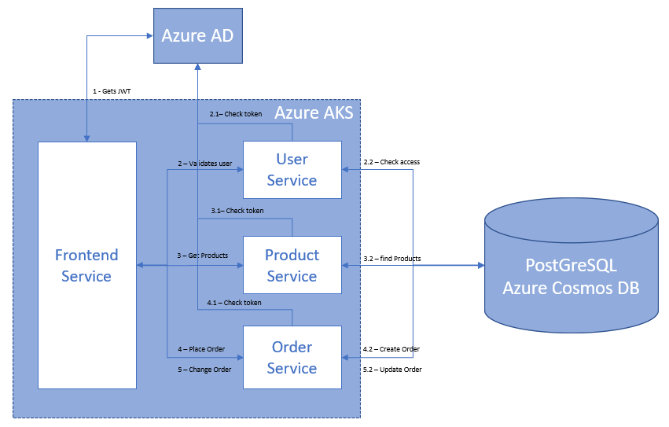
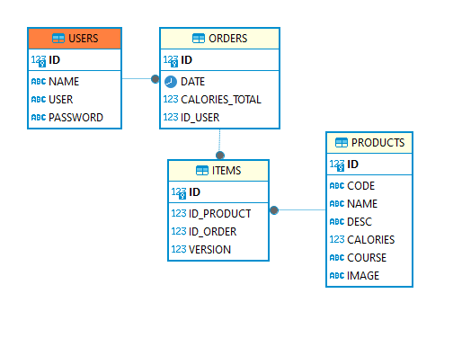

# User Service

The User Service handles user authentication and authorization

## Description

The User Service is responsible for validates users credentials of users registered in the database

## Architecture Diagram

### User Ordering Process

0. **User Access Interface and Enter Credentials:**
- The user accesses the interface and enters their credentials.

1. **Obtain JWT Token and Validate User Credentials:**
- The Frontend Service obtains the JWT token by consuming the AzureAD authentication API.
- Frontend Service invokes the User Service API to validate user credentials.
  1. User Service validates the token using the check token service of the Azure AD API.
  2. User Service queries the database (USERS table) to verify user credentials.
     <- User Service returns the user data to the Frontend Service.

2. **Retrieve Product List:**
- Frontend invokes the Product Service API to obtain the list of products.
  1. Product Service validates the token using the check token service of the Azure AD API.
  2. Product Service queries the database (PRODUCTS table) to retrieve the products.
     <- Product Service returns the data to the Frontend Service.
     <- Frontend displays the order page.
     -> User selects entry, main course, and drinks, then clicks the order button.

3. **Create a New Order:**
- Frontend Service invokes the Order Service API to create a new order.
  1. Order Service validates the token using the check token service of the Azure AD API.
  2. Order Service inserts the selected user data into the database (ORDERS and ITEMS tables).
     <- Order Service returns the created order data to the Frontend Service.
     <- Frontend displays the order summary page with selected product data and the total calories of the order.
     -> User clicks the modify order button.
     <- Frontend displays the order page, allowing the user to make changes.
     -> User selects entry, main course, and drinks, then clicks the order button.

4. **Modify an Existing Order:**
- Frontend Service invokes the Order Service API to modify the order.
  1. Order Service validates the token using the check token service of the Azure AD API.
  2. Order Service modifies the order, creating a new version of its items in the database (ORDERS and ITEMS tables).
     <- Order Service returns the order and its item data to the Frontend.
     <- Frontend displays the order summary page with selected product data and the total calories of the order.

## Database Diagram

## Technologies

- Java 17 with Spring Boot 
- Java Database Connection (JDBC)
- JPA (with Hibernate)
- Spring Security (Azure AD for RestAPI Authentication)
- PostgreSQL (Azure Cosmos DB)
- OpenAPI

## Setup Instructions

1. Clone the repository: `git clone https://github.com/leombprojects/user-service.git`
2. Navigate to the `user-service` directory.
3. Configurations could be done in the boot module on the resources directory (`application-[env].yml`).
4. Build and run the service using your preferred IDE or `mvn spring-boot:run`.

## REST API Endpoints

- `POST /user-service/user/validate`: Validates user credentials

## Features

- **Azure DevOps Integration:**
    - Pipelines Ready
    - Releases Ready

- **Azure Cloud Services Compatibility:**
    - ACR (Azure Container Registry) Ready
    - AKS (Azure Kubernetes Service) Ready

- **Azure Cloud Identity and Access Compatibility:**
  - AD (Azure Active Directory) Ready - OAuth2 RestAPI Authentication

## Usage Notes

- Ensure that you configure the appropriate environment-specific properties in the `application-[env].yml` file.
- The service follows OpenAPI standards for documentation.